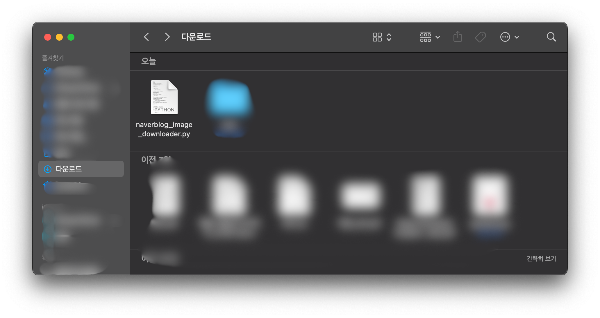
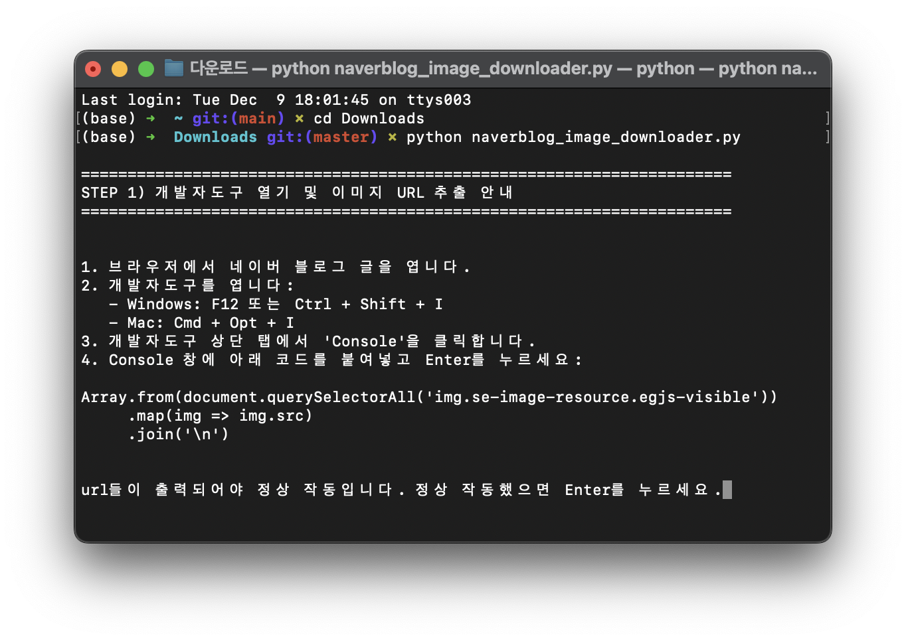
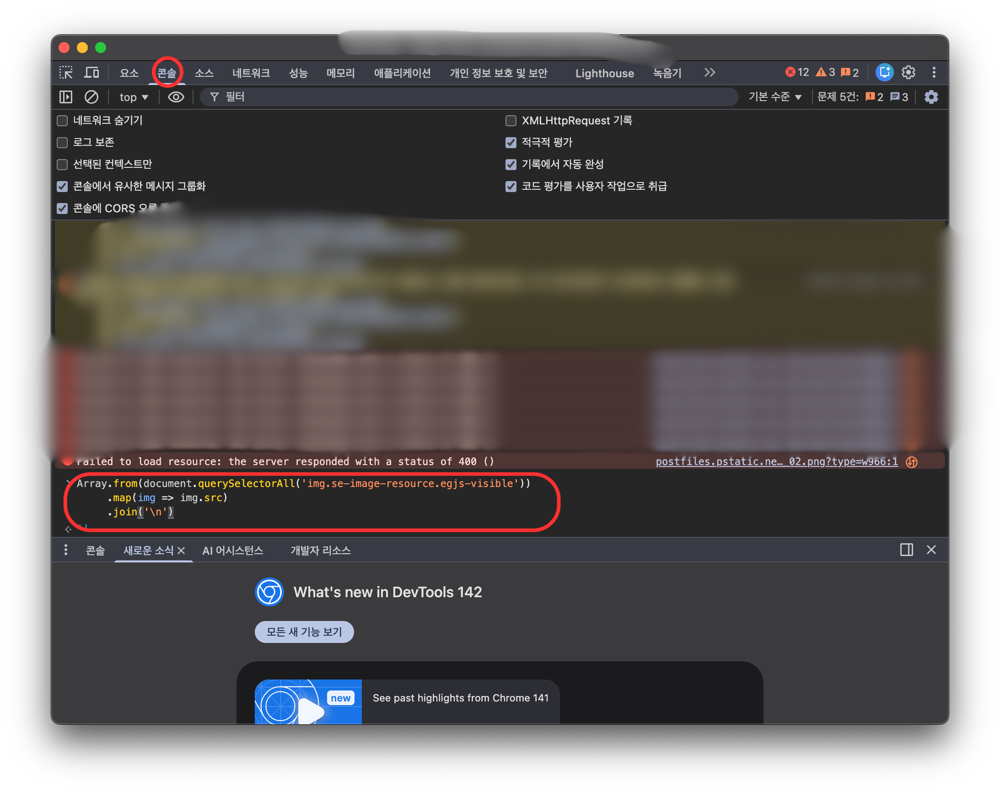
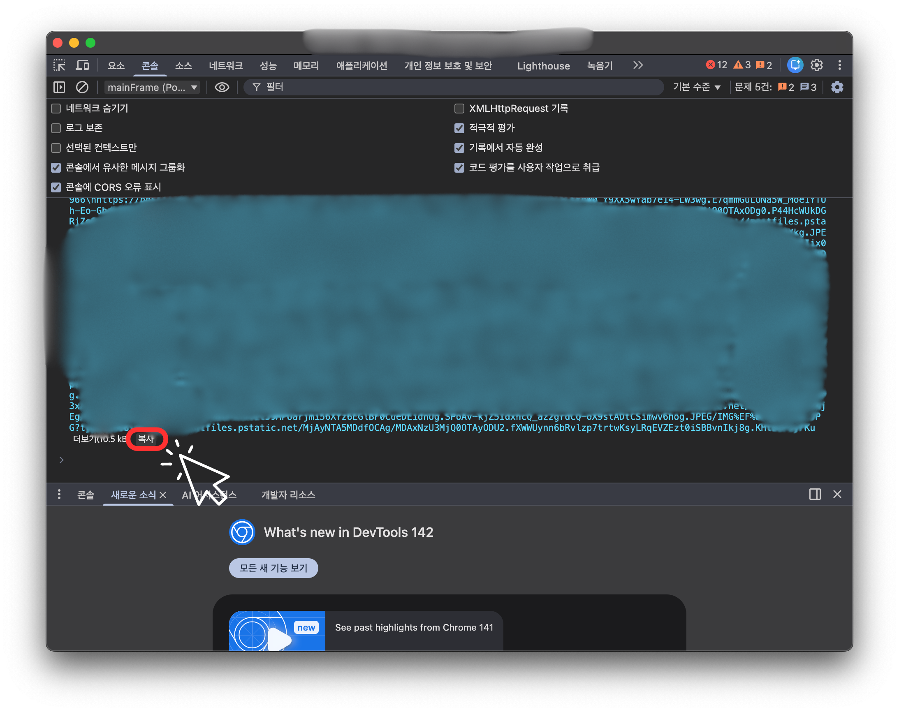
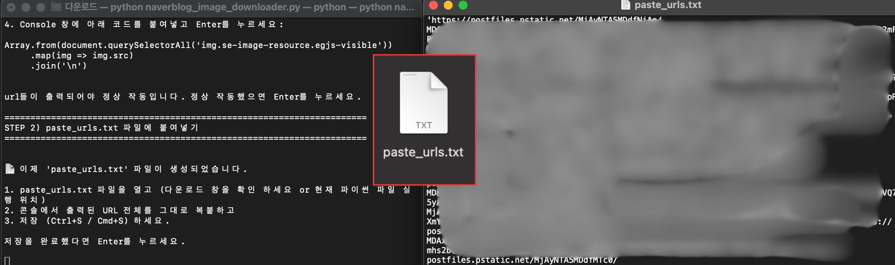

# 네이버 블로그 이미지 일괄 다운로드 코드

네이버 블로그 게시물에서 이미지 URL을 추출해 일괄 다운로드하는 인터랙티브 파이썬 스크립트입니다. 브라우저 콘솔에서 얻은 이미지 URL 목록을 이용해 `downloaded/` 폴더에 파일을 저장합니다.

## 준비물
- Python 3.8+
- `pip install requests`
- PC에 크롬 등 브라우저(개발자도구 사용)

## 사용 방법

### 0단계 (스크립트 다운로드)
- 아직 스크립트가 없다면 아래 버튼으로 바로 내려받습니다.
- 다운로드가 완료되면 저장된 폴더로 이동해 아래 단계를 진행하세요.

[](https://raw.githubusercontent.com/juneshim/naverblog_image_downloader/main/naverblog_image_downloader.py)

### 1~3단계 (기본 준비)
1) 저장소(또는 스크립트)가 있는 폴더로 이동:
```
cd Downloads/
```


2) 필요한 패키지 설치:
```
pip install requests
```

3) 스크립트 실행:
```
python naverblog_image_downloader.py
```


### 4단계 이후 (URL 추출~다운로드)
4) 브라우저 콘솔에서 이미지 URL 추출  
- 네이버 블로그 글을 열고 개발자도구(Console)에 아래 코드를 붙여넣고 실행합니다.
```
Array.from(document.querySelectorAll('img.se-image-resource.egjs-visible'))
     .map(img => img.src)
     .join('\n')
```


- 출력된 URL 전체를 복사합니다.  


5) `paste_urls.txt`에 URL 붙여넣기  
- 스크립트 안내에 따라 생성된 `paste_urls.txt` 파일을 열어 복사한 URL을 붙여넣고 저장합니다.

- Enter를 눌러 다음 단계로 진행합니다.  

6) 줄바꿈 정리 및 블로그 주소 입력  
- 스크립트가 `urls_clean.txt`를 만들며 URL을 정리합니다.
- 이어서 블로그 글 주소(예: `https://blog.naver.com/...`)를 입력합니다. 이것이 Referer 헤더로 사용됩니다.  

7) 다운로드  
- URL 목록을 순회하며 이미지를 `downloaded/` 폴더에 `img_번호.jpg/png`로 저장합니다.
- 완료 후 Enter를 누르면 `paste_urls.txt`, `urls_raw.txt`, `urls_clean.txt`를 자동으로 정리합니다.  

## 폴더 구조
- `naverblog_image_downloader.py`: 실행 스크립트
- `downloaded/`: 다운로드된 이미지가 저장되는 폴더(자동 생성)

## 참고 및 주의
- 네트워크 오류나 HTTP 403이 발생할 경우 블로그 주소를 정확히 입력했는지 확인하세요.
- URL 추출 시 이미지가 화면에 보이는 상태인지 확인해야 합니다(`img.se-image-resource.egjs-visible` 대상).
- 개인적인 백업/학습 용도로 사용하고, 저작권 및 서비스 약관을 준수하세요.

